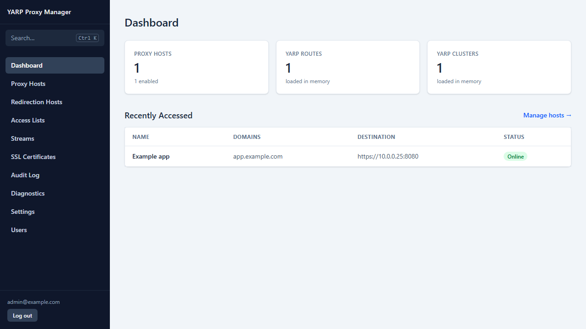
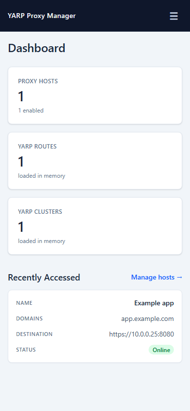
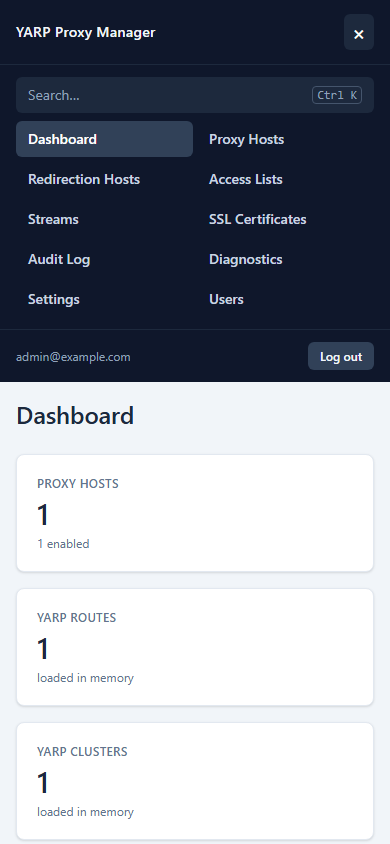
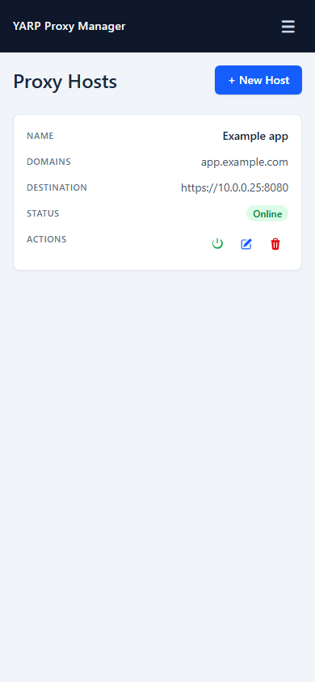

# YARP Proxy Manager

A self-hosted reverse proxy and service gateway for people who want a simple, capable way to publish internal apps and services.

Put HTTP apps, HTTPS certificates, access rules, redirects, and TCP/UDP forwarding behind one dashboard. Changes apply immediately, so you can manage your homelab or small production setup without hand-editing proxy files or restarting the proxy.

## Why use it?

- **Publish internal apps** with hostname-based routing, WebSockets, custom headers, and path locations.
- **Keep HTTPS current** with Let's Encrypt certificates, automatic renewal, HTTP-01, and Cloudflare DNS-01 challenges.
- **Protect sensitive services** with IP/CIDR access lists and common-exploit blocking.
- **Forward more than HTTP** with raw TCP/UDP streams for SSH, databases, MQTT, game servers, and other services.
- **See what is happening** with traffic statistics, health information, recent requests, optional body capture, Prometheus metrics, and an audit log.
- **Run it with minimal overhead** as a single Docker container backed by SQLite.

## See it in action

The dashboard keeps routing, security, certificates, streams, diagnostics, and users together on desktop and mobile.









## Get started

```bash
cd docker
docker compose up -d
```

Open `http://your-host:81`, create the first administrator, and add a proxy host. The container uses:

- `80` for HTTP proxy traffic
- `443` for HTTPS proxy traffic
- `81` for the admin UI and API

The `./data` volume stores the SQLite database, certificates, Data Protection keys, and logs. Configuration changes are applied without a restart.

For a first proxy host:

1. Open **Proxy Hosts → + New Host**.
2. Enter a domain such as `app.example.com`.
3. Point it to an internal destination such as `10.0.0.25:8080`.
4. Add a certificate from **SSL Certificates** when you are ready to serve HTTPS.

## Common setups

| You want to… | Use… |
| --- | --- |
| Publish an internal web app | A **Proxy Host** |
| Send an old domain to a new one | A **Redirection Host** |
| Limit an admin panel to your office or VPN | An **Access List** |
| Expose PostgreSQL, SSH, or another non-HTTP service | A **TCP/UDP Stream** |
| Route several healthy upstreams | Multiple destinations with load balancing and health checks |
| Create hosts automatically from Docker labels | **Docker autodiscovery** |

Detailed walkthroughs and API examples are in the [user guide](docs/USAGE.md).

## Documentation

- [User guide and configuration examples](docs/USAGE.md)
- [REST API reference](docs/API.md)
- [Observability and diagnostics](docs/OBSERVABILITY.md)
- [Development and project structure](docs/DEVELOPMENT.md)

## Security

Create a strong administrator password during first-run setup. Keep port `81` behind a firewall or VPN when the proxy ports are public, and treat API keys as secrets. API-key access is intended for proxy entities; user, backup, and API-key administration require an authenticated admin session.
