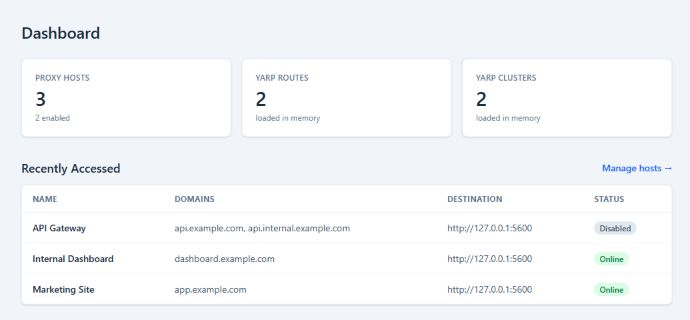
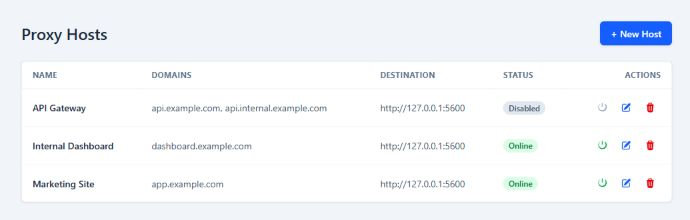
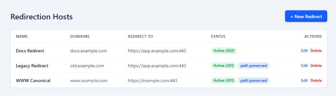
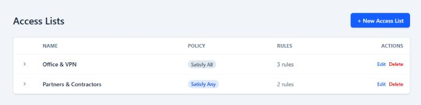
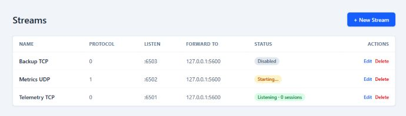
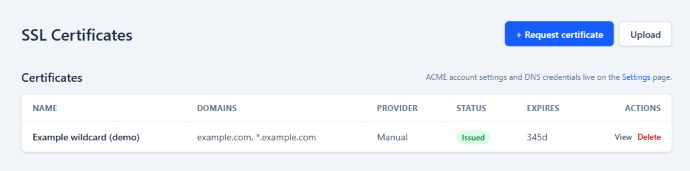
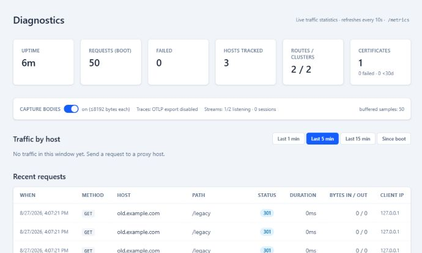
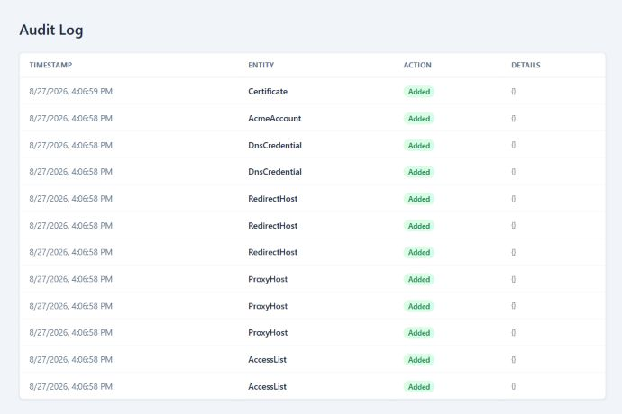
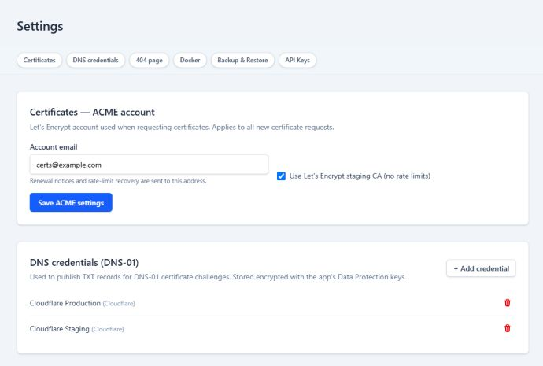
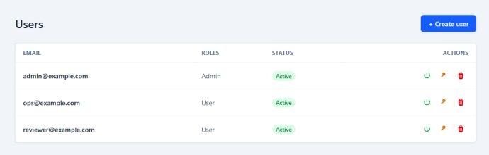

# YARP Proxy Manager

A self-hosted, database-backed reverse proxy manager in the spirit of Nginx Proxy Manager — built on **YARP** (ASP.NET Core / Kestrel) with a **SolidJS** admin UI. One Docker container owns ports 80/443 (proxy) and 81 (admin); proxy configuration is stored in SQLite and hot-reloaded with no restarts.

## Features

- **Proxy hosts** — map hostnames to HTTP(S) destinations, with WebSockets, custom request/response headers, custom locations (path-prefix routing), Force-HTTPS, and per-host SNI certificate selection.
- **Load balancing** — multiple destinations per host with round-robin / least-requests / random / power-of-two-choices / first policies and active health checks.
- **Redirection hosts** — 301/302 redirects with optional path/query preservation.
- **Access lists** — allow/deny rules (IP, CIDR, `*`) with satisfy-any/satisfy-all semantics, enforced before proxying.
- **Exploit blocking** — NPM-style common-exploit filtering.
- **Certificates** — per-host ACME certificates (Let's Encrypt, HTTP-01 or Cloudflare DNS-01), manual PFX/PEM upload, automatic renewal, Kestrel SNI selection.
- **Streams** — raw **TCP/UDP** port forwarding for non-HTTP protocols (see [What is the stream proxy for?](#what-is-the-stream-proxy-for)).
- **Ops** — in-app diagnostics (per-host traffic, recent requests with optional body capture), Prometheus metrics, optional OTLP tracing, JSON backup/restore, immutable audit log, user management, optional OIDC SSO login, and a public REST API ([docs/API.md](docs/API.md)).

## Quick start

```bash
cd docker && docker compose up -d
```

The container owns port 80 (reverse proxy) and 81 (admin UI/API); the data volume at `./data` holds the SQLite database, certificates, Data Protection keys and logs. On a new install, open the admin UI and create the first administrator — there is no built-in default account. For unattended deployments, set both `Admin__Email` and `Admin__Password` before first boot.

Example flow:

1. Open `http://your-host:81`, log in, go to **Proxy Hosts → + New Host**.
2. Enter `app.example.com` as the domain and point it at `10.0.0.25:8080`.
3. Requests to `http://app.example.com` (port 80) are proxied to the destination instantly — no restart.
4. Add a certificate for the domain (**SSL Certificates**) to serve HTTPS with automatic renewal.

> **Security note:** the admin port is unauthenticated only until the first administrator is created. Create a strong password, keep port 81 behind a firewall/VPN if the proxy ports are public, and treat API keys as secrets.

## Screenshots

The admin UI keeps proxy configuration, access controls, streams, certificates, traffic diagnostics, audit history, settings, and users in one place. 





















## Examples

All examples use the REST API on the admin port (`81` in Docker, `5081` in dev) with an API key in the `X-Api-Key` header — see [docs/API.md](docs/API.md) for key management and the full reference. Configuration changes apply immediately; no restart is needed.

### Proxy an HTTP app

```bash
curl -X POST http://your-host:81/api/v1/hosts \
  -H "X-Api-Key: yarp_..." -H "Content-Type: application/json" \
  -d '{
    "name": "My App",
    "domainNames": ["app.example.com"],
    "enabled": true,
    "scheme": "http",
    "forwardHost": "10.0.0.25",
    "forwardPort": 8080,
    "blockCommonExploits": true,
    "forceHttps": false,
    "certificateId": null,
    "accessListId": null,
    "requestHeaders": [{ "target": "Request", "action": "Set", "name": "X-Upstream", "value": "app" }],
    "responseHeaders": [],
    "locations": [],
    "destinations": [],
    "loadBalancingPolicy": null,
    "healthCheckEnabled": false,
    "healthCheckPath": null,
    "healthCheckIntervalSeconds": 10
  }'
```

Now `http://app.example.com` is proxied to `10.0.0.25:8080`, with WebSockets and HTTP/2 enabled and common exploit patterns rejected. To route `/api` to a separate upstream instead, add a location — or use multiple destinations for load balancing:

```json
{
  "locations": [{ "pathPrefix": "/api", "stripPrefix": true, "scheme": "http", "forwardHost": "10.0.0.26", "forwardPort": 9000, "order": 10 }],
  "destinations": [
    { "forwardHost": "10.0.0.11", "forwardPort": 8080 },
    { "forwardHost": "10.0.0.12", "forwardPort": 8080 }
  ],
  "loadBalancingPolicy": "roundrobin",
  "healthCheckEnabled": true,
  "healthCheckPath": "/health",
  "healthCheckIntervalSeconds": 10
}
```

### Serve HTTPS with an ACME certificate

Request a Let's Encrypt certificate via HTTP-01, then attach it to the host and force HTTPS:

```bash
curl -X POST http://your-host:81/api/v1/certificates/issue \
  -H "X-Api-Key: yarp_..." -H "Content-Type: application/json" \
  -d '{ "name": "App cert", "domains": ["app.example.com"], "challengeType": "Http01" }'
# → { "id": "...", "status": "Issued", ... }
```

Update the host with `"certificateId": "<cert-id>"` and `"forceHttps": true` (`PUT /api/v1/hosts/{id}`). Port 443 then serves HTTPS with SNI selecting the certificate; renewal is automatic. Wildcard domains need DNS-01 (Cloudflare): use `"challengeType": "Dns01"` plus a DNS credential id.

### Redirect a domain

301-redirect `old.example.com` to `https://www.example.com`, preserving the path:

```bash
curl -X POST http://your-host:81/api/v1/redirects \
  -H "X-Api-Key: yarp_..." -H "Content-Type: application/json" \
  -d '{
    "name": "Old domain",
    "domainNames": ["old.example.com"],
    "enabled": true,
    "statusCode": 301,
    "preservePath": true,
    "forwardScheme": "https",
    "forwardHost": "www.example.com",
    "forwardPort": 443,
    "certificateId": null
  }'
```

### Restrict a host to your office network

```bash
curl -X POST http://your-host:81/api/v1/access-lists \
  -H "X-Api-Key: yarp_..." -H "Content-Type: application/json" \
  -d '{
    "name": "Office only",
    "satisfyAny": true,
    "rules": [
      { "action": "Allow", "pattern": "203.0.113.0/24" },
      { "action": "Allow", "pattern": "198.51.100.7" },
      { "action": "Deny", "pattern": "*" }
    ]
  }'
```

Then set `"accessListId": "<list-id>"` on the host. Rules are evaluated before proxying; with `satisfyAny`, a single Allow match passes.

### Forward a non-HTTP port (stream)

Expose an internal PostgreSQL without publishing it to the internet — TCP port 5432 on the proxy forwards to `10.0.0.40:5432`:

```bash
curl -X POST http://your-host:81/api/v1/streams \
  -H "X-Api-Key: yarp_..." -H "Content-Type: application/json" \
  -d '{
    "name": "Postgres",
    "enabled": true,
    "protocol": "Tcp",
    "listenPort": 5432,
    "forwardHost": "10.0.0.40",
    "forwardPort": 5432
  }'
```

Remember to publish the stream port in `docker/docker-compose.yml` (streams are not published by default). UDP works the same way with `"protocol": "Udp"`.

## What is the stream proxy for?

YARP proxies **HTTP**, which covers web apps, APIs and WebSockets. The **streams** feature handles everything else — raw byte forwarding of TCP or UDP:

- **Databases** (MySQL/PostgreSQL/Redis/MongoDB) that you don't want to expose directly to the internet.
- **SSH** — forward port 22 to an internal box.
- **Custom TCP protocols** (game servers, legacy line protocols, MQTT without TLS).
- **UDP services** (DNS forwarding, syslog, NTP, game voice).

Configure a stream with a listen port, protocol and destination; the manager validates port conflicts against the proxy ports and reports per-stream status (sessions, bytes in/out) in the UI.

## Docker autodiscovery (traefik-style labels)

Run the manager with the Docker engine socket mounted (`/var/run/docker.sock`) and enable **Docker integration** on the Settings page. Containers opt in with labels; the manager creates a proxy host for each and disposes it again when the container disappears:

```yaml
services:
  my-app:
    image: my-app:latest
    labels:
      proxy-manager.enable: "true"
      proxy-manager.host: "app.example.com"
      proxy-manager.port: "8080"          # container port
      proxy-manager.scheme: "http"        # optional: http | https
      proxy-manager.name: "My App"        # optional display name
```

Put the manager and the published containers on a shared network so the proxy can reach the container IPs. See `benchmarks/` for the load-test harness and `docs/API.md` for the settings endpoints.

## REST API

The admin UI runs on the same JSON API exposed under `/api/v1` on the admin port. Programmatic access uses API keys (`X-Api-Key` header) that can manage every proxy entity — hosts, redirects, access lists, streams, certificates — but not users, backups or API keys themselves. Full reference with examples: **[docs/API.md](docs/API.md)**.

## Observability

Live traffic statistics are available in-app (**Admin → Diagnostics**): per-host request counts, status-code and latency breakdowns, a recent-requests view with optional request/response body capture, stream/certificate health, and system counters. `GET /metrics` on the admin port exposes the same per-host data (`traffic_*`) plus ASP.NET/Kestrel/HttpClient metrics for Prometheus. Distributed traces (OTLP) are opt-in. See **[docs/OBSERVABILITY.md](docs/OBSERVABILITY.md)**; a Prometheus + Tempo + Grafana stack is provided as a compose profile:

```bash
cd docker && docker compose -f docker-compose.yml -f docker-compose.observability.yml up -d
```

## Development

Backend (dev ports 5080/5443/5081 — no admin rights needed):

```bash
dotnet run --project src/ProxyManager.Api
```

Frontend (Vite on http://localhost:3000, `/api` proxied to the backend):

```bash
cd web && pnpm install && pnpm dev
```

Tests / CI:

```bash
dotnet test ProxyManager.slnx
cd web && pnpm test -- --run && pnpm build
```

## Layout

```
src/
├── ProxyManager.Domain/          Entities, enums — no dependencies
├── ProxyManager.Application/     Use-cases, DTOs, validation (FluentValidation)
├── ProxyManager.Infrastructure/  EF Core DbContext, migrations, audit interceptor, Cloudflare DNS client
├── ProxyManager.Proxy/           YARP config projection, middleware (redirects, access lists, exploits)
├── ProxyManager.Certificates/    ACME (Certes) service, SNI certificate selector, renewal worker
├── ProxyManager.Streams/         TCP/UDP forwarder subsystem (YARP is HTTP-only)
└── ProxyManager.Api/             ASP.NET host: Kestrel endpoints, controllers, Identity, static UI
web/                              SolidJS 2 + Tailwind v4 admin UI (Vite build → dist/client)
tests/ProxyManager.Tests/         xUnit smoke/integration/unit tests
docs/                             REST API reference, observability guide
scripts/                          NPM → YARP migration script, diagnostics helpers
benchmarks/                       k6 load-test harness (YARP vs nginx)
```
